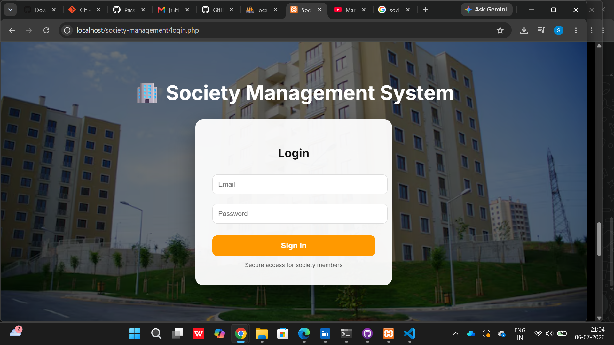
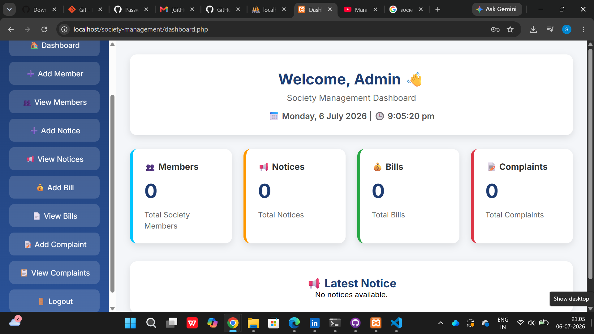
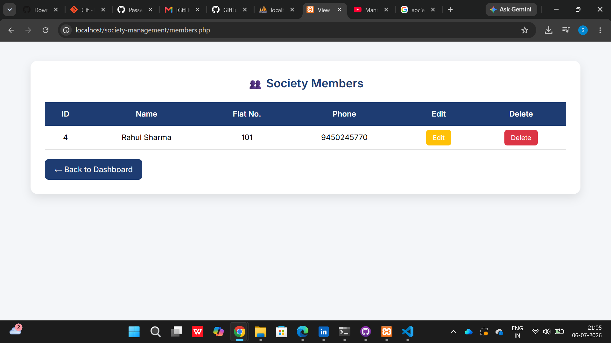
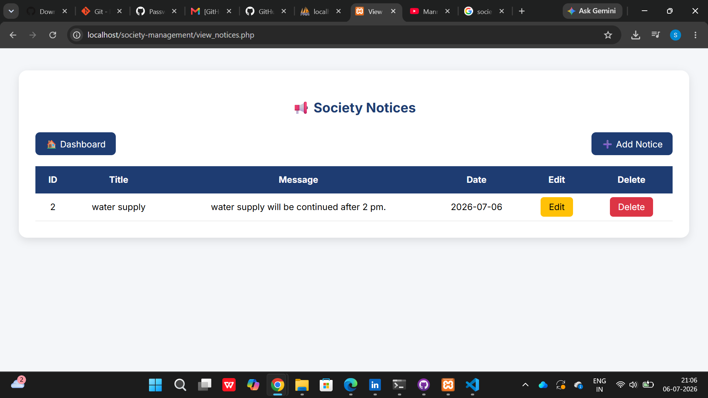
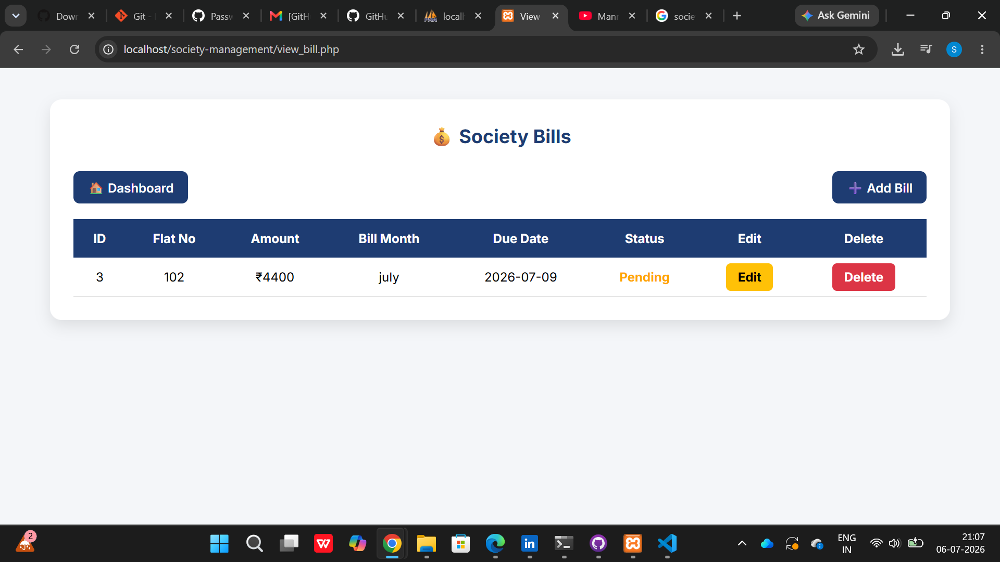
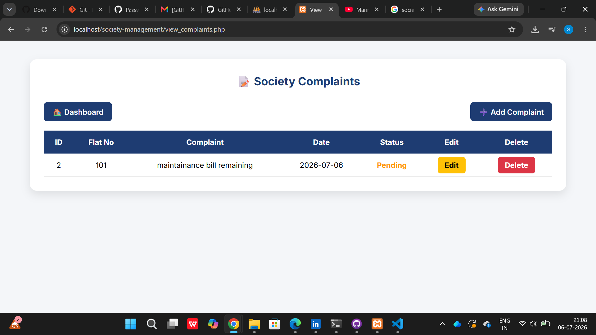

# 🏢 Society Management System

A web-based **Society Management System** developed using **PHP, MySQL, HTML, CSS, JavaScript, Bootstrap, and SweetAlert**. This application helps manage society members, notices, bills, and complaints through an easy-to-use interface.

---

## 📌 Features

* 🔐 Secure Admin Login & Logout
* 👥 Member Management (Add, Edit, Delete, View)
* 📢 Notice Management (Add, Edit, Delete, View)
* 💰 Bill Management (Add, Edit, Delete, View)
* 📝 Complaint Management (Add, Edit, Delete, View)
* 📊 Dashboard with Live Statistics
* 📅 Live Date & Time Display
* 📢 Latest Notice Display
* ⚠️ SweetAlert Delete Confirmation
* 📱 Responsive and User-Friendly Interface

---

## 🛠️ Technologies Used

* PHP
* MySQL
* HTML5
* CSS3
* JavaScript
* Bootstrap
* SweetAlert
* XAMPP

---

## 📂 Project Structure

```text
Society-Management-System/
│   ├── login.png
│   ├── dashboard.png
│   ├── members.png
│   ├── notices.png
│   ├── bills.png
│   └── complaints.png
│── login.php
│── dashboard.php
│── members.php
│── notices.php
│── bills.php
│── complaints.php
│── config.php
│── society_db.sql
│── README.md
```

---

## 🚀 Installation

1. Install XAMPP.
2. Copy the project folder into the `htdocs` directory.
3. Start **Apache** and **MySQL** from the XAMPP Control Panel.
4. Open **phpMyAdmin**.
5. Create a database named **society_db**.
6. Import the **society_db.sql** file.
7. Open your browser and visit:

```text
http://localhost/Society-Management-System/
```

---

## 🔑 Login Credentials

* **Email:** [admin@gmail.com]
* **Password:** 1234

---

## 📸 Screenshots

### Login Page



### Dashboard



### Members



### Notices



### Bills



### Complaints



---

## 🎯 Future Enhancements

* User Role Management
* Email Notifications
* Online Maintenance Payment
* Visitor Management
* Report Generation
* Mobile-Friendly Enhancements

---

## 👩‍💻 Developer

**Sanika**

---

## 📄 License

This project is developed for educational purposes.
